# APK dosyasına Toast Mesajı Nasıl Eklenir? 

```
def hello_world():
    print("Hello, World!")
```


---

## Adım 1: APK Dosyasını seçin


---

## Adım 2: 

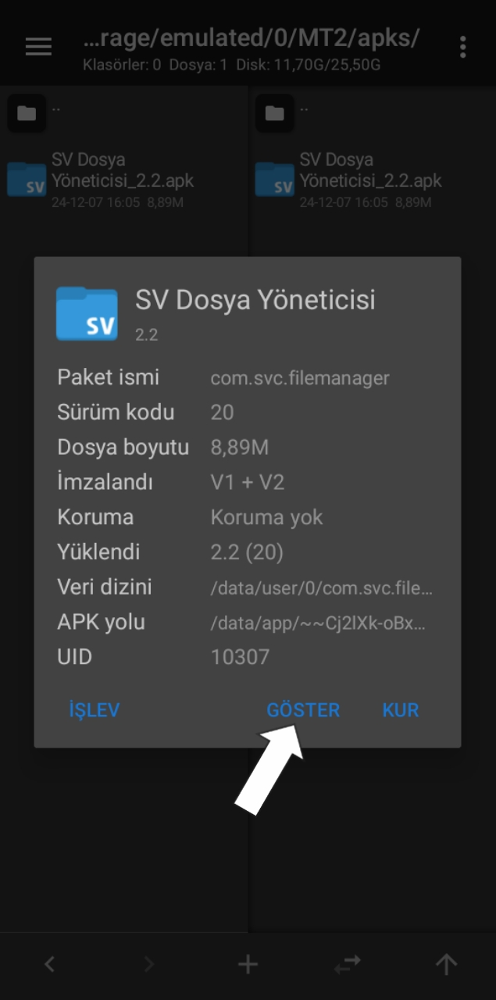

---

## Adım 3: 

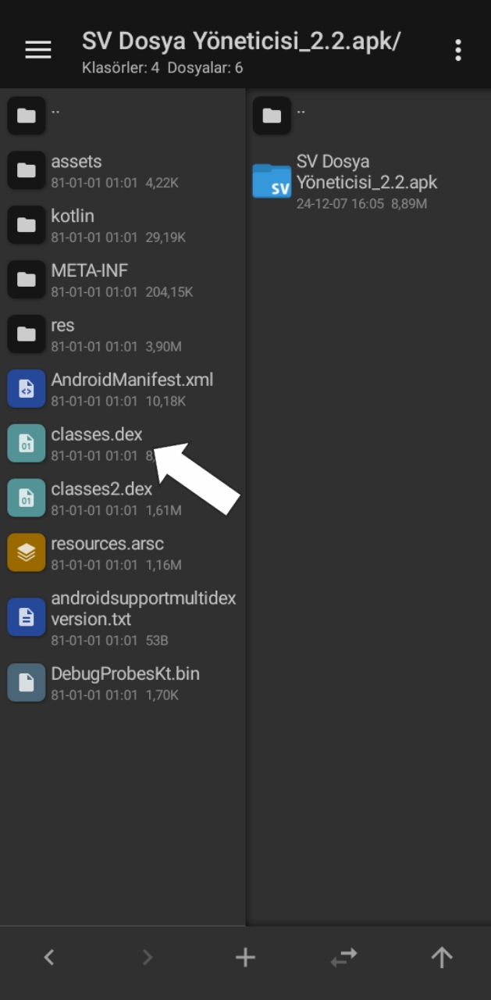

---

## Adım 4: 

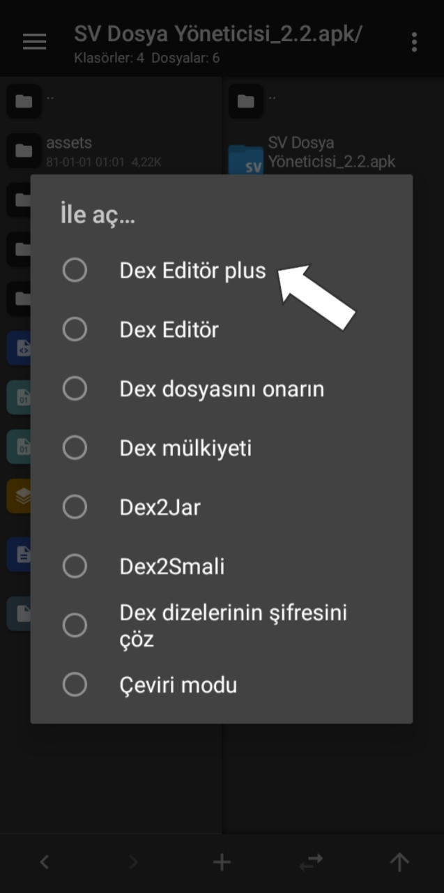

---

## Adım 5: 

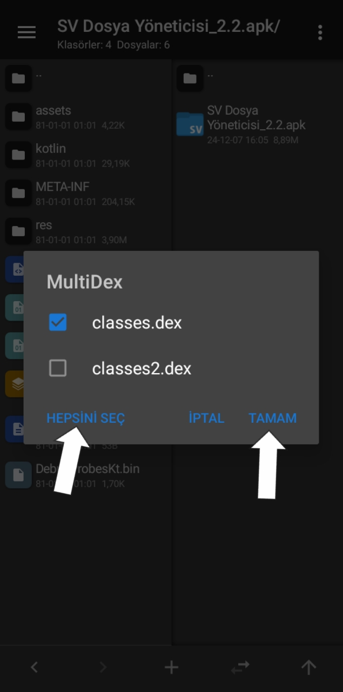

---

## Adım 6: 

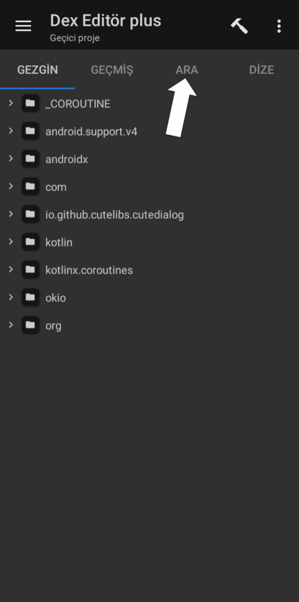

---

## Adım 7: 


---

## Adım 8: 

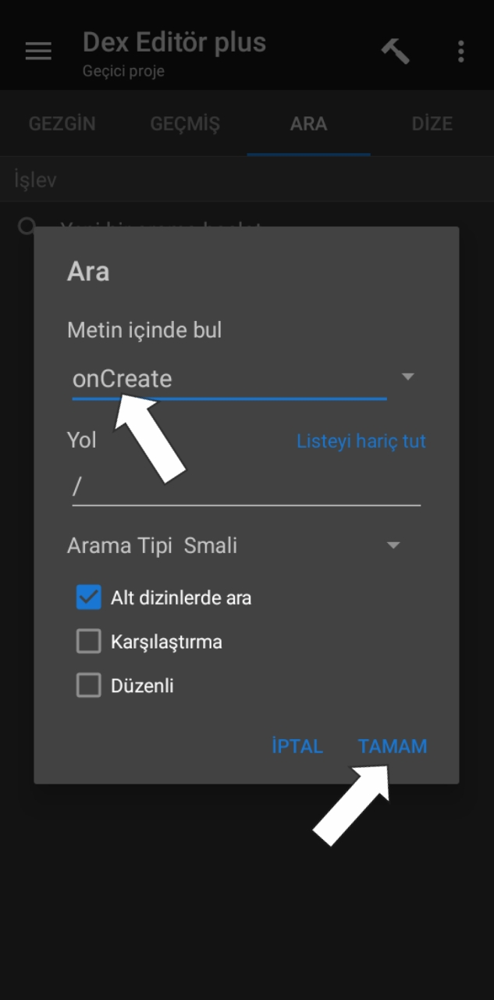

---

## Adım 9: 

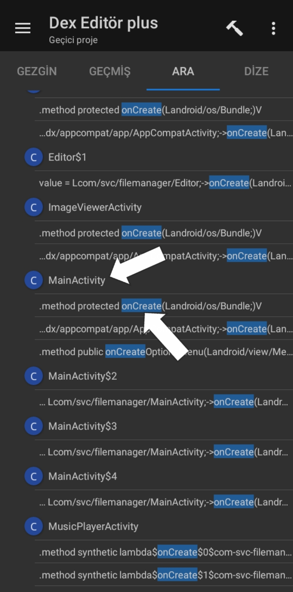

---

## Adım 10: 

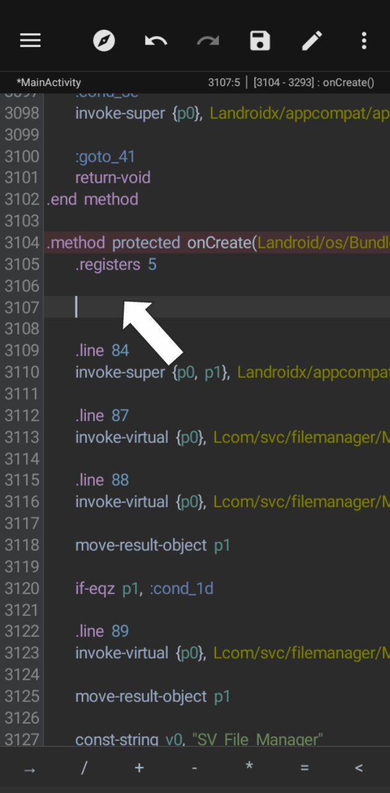

---

## Adım 11: 

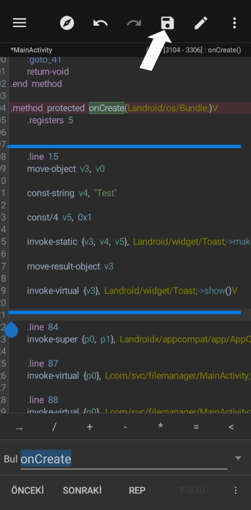

---

## Adım 12: 

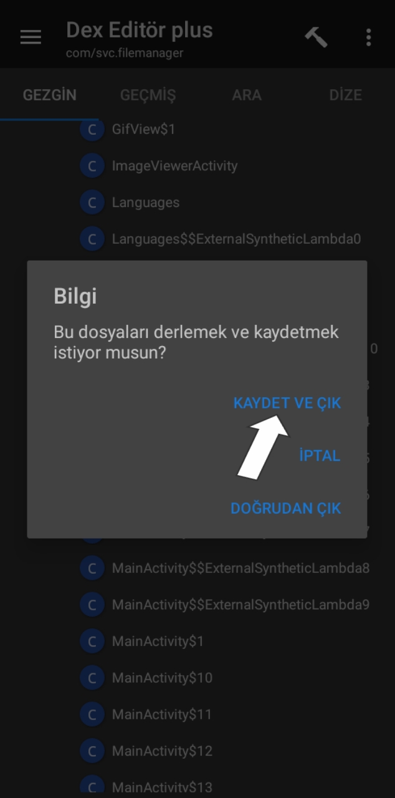

---

## Adım 13: 

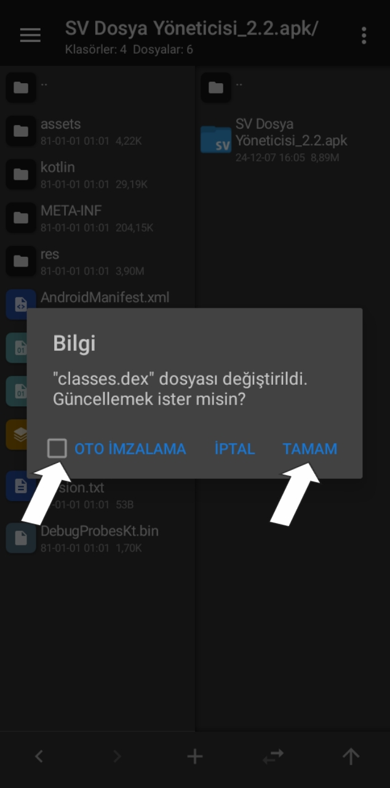

---

