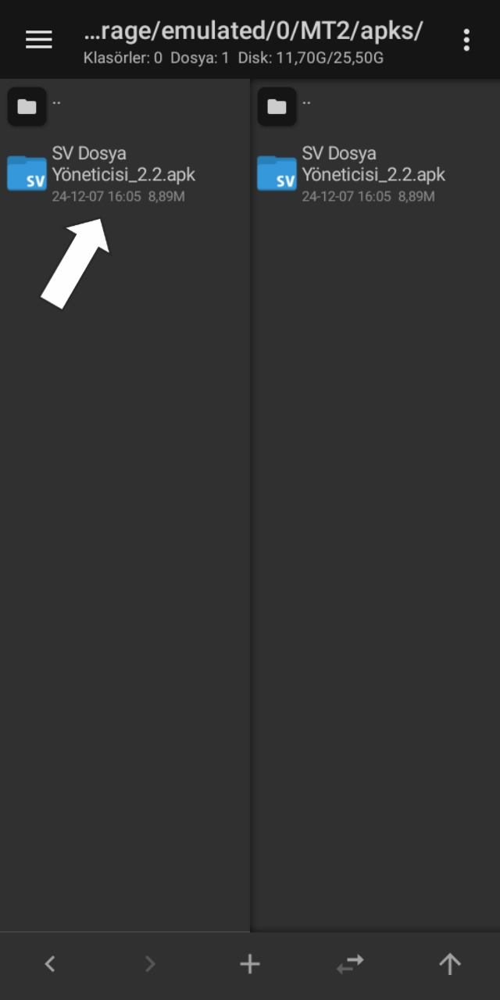

# APK dosyasına Toast Mesajı Nasıl Eklenir? 

```smali
.line 14
    const-string v0, "Toast Mesajınız"

    const/4 v1, 0x1

    invoke-static {p0, v0, v1}, Landroid/widget/Toast;->makeText(Landroid/content/Context;Ljava/lang/CharSequence;I)Landroid/widget/Toast;

    move-result-object v0

    invoke-virtual {v0}, Landroid/widget/Toast;->show()V
```


---

## Adım 1: APK Dosyasını seçin



---

## Adım 2: 


---

## Adım 3: 


---

## Adım 4: 


---

## Adım 5: 


---

## Adım 6: 


---

## Adım 7: 


---

## Adım 8: 


---

## Adım 9: 


---

## Adım 10: 


---

## Adım 11: 


---

## Adım 12: 


---

## Adım 13: 


---

